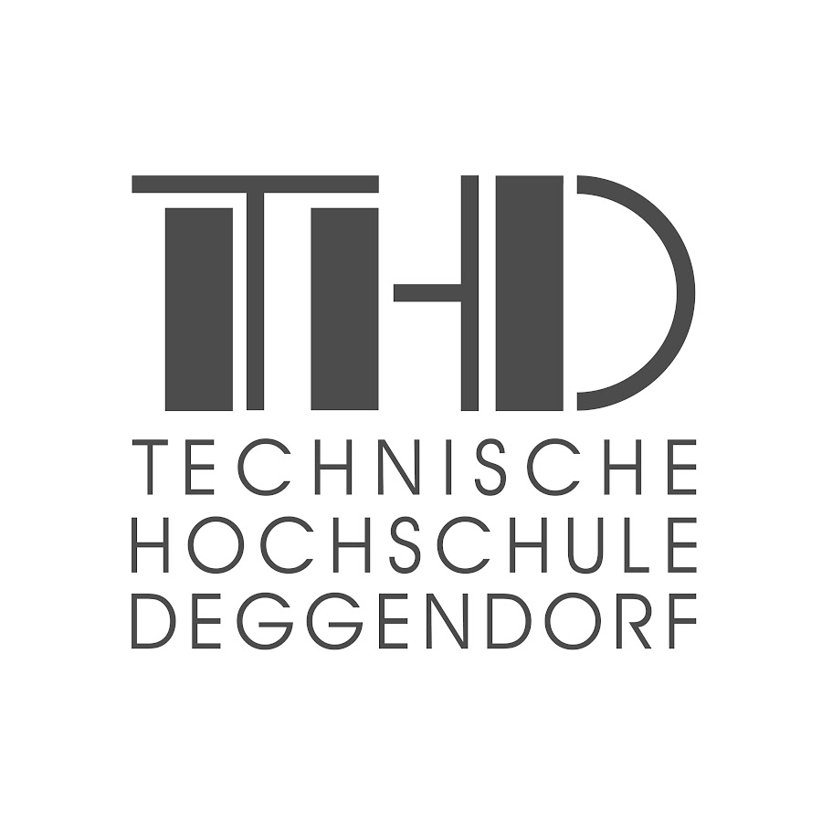

# 🦺 PPE Helmet Detection

<div align="center">



**TH Deggendorf · MSS-M-2 · Machine Learning & Deep Learning · SS26**

---


**Real-time PPE helmet detection using deep learning and computer vision.**  
Detects safety helmet compliance on construction sites — evaluated across three architectures.

[Overview](#overview) · [Results](#results) · [Model Comparison](#model-comparison) · [Dataset](#dataset) · [Installation](#installation) · [Usage](#usage)

</div>

---

## Overview

This project implements an end-to-end **Personal Protective Equipment (PPE) detection pipeline** that automatically identifies whether workers on construction sites are wearing safety helmets in real time.

Built as a **Machine Learning & Deep Learning Case Study** at **TH Deggendorf (SS26)**, the system processes camera feeds at ~75 FPS and flags compliance violations instantly — eliminating the need for manual safety inspections.

```
Live Camera / Video  →  YOLOv8s  →  Helmet ✅ / No_Helmet ❌  →  Violation Alert
```

To scientifically validate the approach, two additional **Faster R-CNN** variants were trained on the identical dataset — one with COCO pretrained weights, one trained without — enabling a rigorous three-way architectural comparison.

> 📍 **Institution:** Technische Hochschule Deggendorf  
> 📚 **Course:** Case Study Machine Learning & Deep Learning  
> 👥 **Group:** MSS-M-2 · Summer Semester 2026  
> 🖥️ **GPU:** Tesla T4 (Google Colab)

---

## Demo


*HelmGuard desktop application — real-time helmet compliance monitoring via webcam.*

---

## Results

### YOLOv8s — Validation Metrics

| Metric | Value |
|--------|-------|
| mAP@0.50 | **84.4%** |
| mAP@0.50:0.95 | **47.4%** |
| Precision | 88.5% |
| Recall | 82.1% |
| Inference Speed | **~75 FPS** (13.3 ms/img, Tesla T4) |

### Per-Class Performance

| Class | Images | Instances | Precision | Recall | mAP@0.50 | mAP@0.50:0.95 |
|-------|--------|-----------|-----------|--------|----------|---------------|
| ✅ Helmet | 192 | 543 | 92.0% | 91.2% | 93.8% | 56.7% |
| ❌ No_Helmet | 33 | 100 | 85.0% | 73.0% | 75.0% | 38.1% |
| **All** | **203** | **643** | **88.5%** | **82.1%** | **84.4%** | **47.4%** |

---

## Model Comparison

Three models were trained and evaluated on the same dataset under identical hardware conditions (Tesla T4) to enable a controlled architectural comparison.

### Three-Way Comparison


| Model | Val mAP@0.50 | Test mAP@0.50 | mAP@0.50:0.95 | Helmet AP | No-Helmet AP | FPS |
|-------|-------------|--------------|---------------|-----------|--------------|-----|
| **YOLOv8s (w/ COCO)** | **84.4%** | — | **47.4%** | **93.8%** | **75.0%** | **75** |
| Faster R-CNN (w/ COCO) | 88.3% | 81.3% | 49.2% | 52.3% | 46.1% | 6.4 |
| Faster R-CNN (w/o COCO) | 86.1% | 77.3% | 44.1% | 47.3% | 40.9% | 6.4 |

> Note: YOLOv8s was evaluated on the validation split. Both Faster R-CNN variants were evaluated on a held-out test split (80/10/10 split, `seed=42`).

### Faster R-CNN Training History


| Model | Best Val mAP@0.50 | Best Epoch | Final Loss |
|-------|------------------|------------|------------|
| R-CNN w/ COCO | **88.32%** | Epoch 6 | 0.2549 |
| R-CNN w/o COCO | 86.12% | Epoch 8 | 0.3371 |

**Key observations:**

COCO pretraining provides a strong initialization — the R-CNN w/ COCO model converges faster and achieves higher val mAP, confirming the value of transfer learning even when fine-tuning on a domain-specific dataset. Without COCO weights, the model recovers using ImageNet backbone features but requires more epochs to converge.

YOLOv8s, while evaluated at a lower mAP@0.50:0.95 threshold, runs at **~12× the frame rate** of either R-CNN variant, making it the practical choice for real-time deployment.

### Why Three Models?

| | YOLOv8s w/ COCO | R-CNN w/ COCO | R-CNN w/o COCO |
|---|---|---|---|
| Architecture | One-stage | Two-stage | Two-stage |
| Pretrained | COCO | COCO | ImageNet only |
| Transfer learning | ✅ Full | ✅ Full | ⚠️ Backbone only |
| Speed | ✅ Real-time | ❌ Slow | ❌ Slow |
| Localization precision | Good | High | Moderate |
| Best for | Production | Research baseline | Ablation study |

---

## Dataset

| Property | Value |
|----------|-------|
| Source | Kaggle — Helmet Detection Dataset |
| Raw images collected | 4,877 |
| Manually annotated | 1,012 images via Roboflow |
| Classes | `Helmet`, `No_Helmet` |
| Train split | 4,925 images (after augmentation) |
| Val split | 203 images · 643 instances |
| Annotation format | YOLO bounding boxes |
| R-CNN split | 80 / 10 / 10 (`seed=42`, reproducible) |

### Data Augmentation

| Augmentation | Parameters | Purpose |
|-------------|-----------|---------|
| Horizontal Flip | p=0.5 | Camera orientation variance |
| Brightness | ±25% | Indoor/outdoor lighting |
| Grayscale | p=0.15 | CCTV/monochrome feeds |
| HSV Jitter | H=0.015, S=0.7, V=0.4 | Color robustness |
| Mosaic | 1.0 (disabled last 10 epochs) | Small object detection |
| Random Erasing | 0.4 | Occlusion robustness |

---

## Training

### YOLOv8s

```python
from ultralytics import YOLO

model = YOLO('yolov8s.pt')
model.train(
    data='data.yaml',
    epochs=25,
    imgsz=800,
    batch=16,
    optimizer='auto',   # AdamW selected automatically
)
```

| Parameter | Value |
|-----------|-------|
| Architecture | YOLOv8s — 11.1M parameters, 28.4 GFLOPs |
| Pretrained weights | COCO (transferred 349/355 layers) |
| Epochs | 25 |
| Image size | 800 × 800 |
| Batch size | 16 |
| Optimizer | AdamW (lr=0.001667, momentum=0.9) |
| Best epoch | 15 |

### Faster R-CNN (w/ COCO)

```bash
python faster_rcnn/with_coco/main.py train --coco --epochs 10
```

| Parameter | Value |
|-----------|-------|
| Architecture | ResNet-50 FPN |
| Pretrained weights | COCO_V1 — head replaced for 3 classes |
| Epochs | 10 |
| Optimizer | SGD (lr=0.005, momentum=0.9, wd=0.0005) |
| Best epoch | 6 (val mAP@0.50 = 88.32%) |

### Faster R-CNN (w/o COCO)

```bash
python faster_rcnn/without_coco/main.py train --epochs 10
```

| Parameter | Value |
|-----------|-------|
| Architecture | ResNet-50 FPN |
| Pretrained weights | ImageNet backbone only (no COCO) |
| Epochs | 10 |
| Optimizer | SGD (lr=0.005, momentum=0.9, wd=0.0005) |
| Best epoch | 8 (val mAP@0.50 = 86.12%) |

---

## Installation

```bash
git clone https://github.com/BUAksakal/ppe-helmet-detection.git
cd ppe-helmet-detection
pip install ultralytics opencv-python PyQt5 numpy torch torchvision torchmetrics
```

---

## Usage

**Run HelmGuard desktop app:**
```bash
python yolov8/app.py
```

**Run YOLOv8 inference on webcam:**
```python
from ultralytics import YOLO

model = YOLO('yolov8/best.pt')
model.predict(source=0, show=True, conf=0.5)
```

**Evaluate Faster R-CNN (w/ COCO):**
```bash
python faster_rcnn/with_coco/main.py evaluate \
    --checkpoint checkpoints_coco/best_model.pth \
    --split test
```

**Evaluate Faster R-CNN (w/o COCO):**
```bash
python faster_rcnn/without_coco/main.py evaluate \
    --checkpoint checkpoints/best_model.pth \
    --split test
```

**Generate 3-model comparison chart:**
```bash
python faster_rcnn/without_coco/main.py compare \
    --rcnn-coco-map50-val 0.8832 \
    --rcnn-coco-map50-test 0.8127 \
    --rcnn-coco-map 0.4919 \
    --rcnn-coco-helmet-ap50 0.5225 \
    --rcnn-coco-head-ap50 0.4614
```

---

## Project Structure

```
ppe-helmet-detection/
│
├── assets/
│   ├── thd_logo.png               # TH Deggendorf logo
│   └── ...                        # Demo screenshots, figures
│
├── results/
│   ├── comparison_final.png       # 3-model comparison chart
│   └── training_curves_final.png  # R-CNN training history
│
├── yolov8/
│   ├── app.py                     # HelmGuard desktop application
│   ├── best.pt                    # Trained YOLOv8s weights
│   ├── train_yolov8.ipynb         # Training notebook
│   └── requirements.txt
│
├── faster_rcnn/
│   ├── with_coco/
│   │   ├── main.py                # Training & evaluation script
│   │   ├── train_faster_rcnn_coco_v2.ipynb
│   │   ├── results_coco.json      # Test evaluation results
│   │   └── train_history.json     # Per-epoch metrics
│   │
│   └── without_coco/
│       ├── main.py                # Training & evaluation script
│       ├── results.json           # Test evaluation results
│       └── train_history.json     # Per-epoch metrics
│
├── .gitignore
├── LICENSE
└── README.md
```

---

## References

- Wang et al. (2021). *Fast PPE Detection for Real Construction Sites Using Deep Learning.* Sensors, 21(10).
- Nath et al. (2020). *Deep learning for site safety: Real-time detection of PPE.* Automation in Construction, 112.
- Otgonbold et al. (2022). *SHEL5K: An Extended Dataset for Safety Helmet Detection.* Sensors, 22(6).
- Kumar et al. (2024). *PPE Detection using YOLOv8.* Cogent Engineering, 11(1).
- Ren et al. (2015). *Faster R-CNN: Towards Real-Time Object Detection with Region Proposal Networks.* NeurIPS.

---

<div align="center">


*Made with ❤️ for safer workplaces through AI*  
**TH Deggendorf · MSS-M-2 · SS26**

</div>
